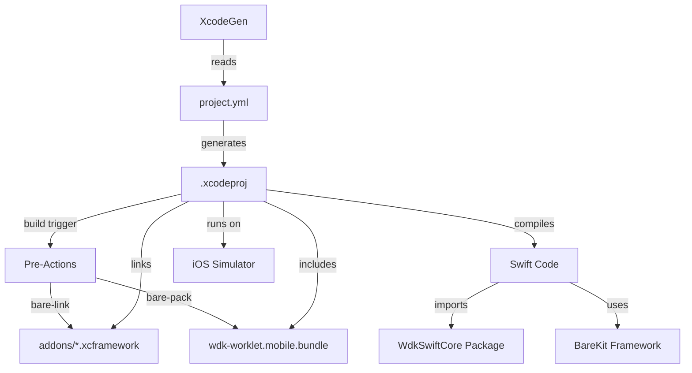

# WDK Starter Swift

Complete iOS example demonstrating WDK Swift Core integration with XcodeGen.

## Overview

This is a minimal, working example of integrating WDK Swift Core into an iOS application. It demonstrates:

- XcodeGen project configuration
- Automatic worklet bundling via pre-actions
- Basic WDK operations (entropy generation, mnemonic handling)
- Clean SwiftUI interface

## Prerequisites

- **macOS** 14.0+
- **Xcode** 15.0+
- **Node.js** 18+ and npm
- **XcodeGen**: Install with `brew install xcodegen`

## Quick Start

### 1. Install Worklet Dependencies

```bash
cd ../wdk-swift-core/WorkletSource/pear-wrk-wdk-jsonrpc
npm install
```

### 2. Verify BareKit Framework

The BareKit.xcframework should already be in `frameworks/`. If not, copy it:

```bash
cp -r /path/to/BareKit.xcframework frameworks/
```

### 3. Generate Xcode Project

```bash
xcodegen generate
```

This creates `wdk-starter-swift.xcodeproj`.

### 4. Open and Run

```bash
open wdk-starter-swift.xcodeproj
```

In Xcode:
1. Select a simulator (iPhone 15 Pro recommended)
2. Press `Cmd+R` to build and run
3. Click "Test WDK" button in the app
4. Check console for detailed logs

## What Happens on Build

### Pre-Actions (Automatic)

Before each build, Xcode automatically runs:

1. **Link Addons** (`bare-link`)
   - Generates 17 native addon xcframeworks
   - Places them in `addons/` directory
   - Takes ~5-10 seconds on first run

2. **Pack Bundle** (`bare-pack`)
   - Bundles JavaScript worklet
   - Creates `wdk-worklet.mobile.bundle`
   - Takes ~2-3 seconds

These pre-actions ensure the runtime is always up to date.

## Project Structure

```
wdk-starter-swift/
├── project.yml                        # XcodeGen configuration
├── WdkStarterApp/
│   ├── App.swift                      # App entry point
│   ├── ContentView.swift              # Demo UI with WDK test
│   ├── Info.plist                     # App metadata
│   ├── wdk-starter-swift.entitlements # JIT entitlement
│   └── Assets.xcassets/               # App icons
├── frameworks/
│   └── BareKit.xcframework/           # BareKit (prebuilt)
├── addons/
│   ├── addons.yml                     # 17 addon dependencies
│   ├── .gitignore                     # Ignore generated files
│   └── *.xcframework                  # Generated by bare-link
├── wdk-worklet.mobile.bundle/         # Generated by bare-pack
└── README.md                          # This file
```

## Key Files

### project.yml

XcodeGen configuration that:
- References WdkSwiftCore package (local path)
- Includes BareKit framework and package
- Lists 17 addon xcframeworks (via `addons/addons.yml`)
- Configures pre-actions for bundling
- Sets JIT entitlement

### ContentView.swift

Demo UI that:
1. Starts the worklet
2. Generates entropy
3. Retrieves mnemonic
4. Displays results

### addons/addons.yml

Lists all 17 required bare addon frameworks:
- bare-buffer, bare-crypto, bare-dns, bare-fs
- bare-hrtime, bare-inspect, bare-os, bare-performance
- bare-pipe, bare-signals, bare-tcp, bare-tls
- bare-tty, bare-type, bare-url, bare-zlib
- sodium-native

## How It Works



## Testing the App

### Expected Behavior

When you tap "Test WDK":

1. Status shows "Starting worklet..."
2. Status shows "Generating entropy..."
3. Status shows "Getting mnemonic..."
4. Final status: "✅ All tests passed!"
5. Results show:
   - ✅ Worklet started
   - ✅ Entropy generated (with truncated keys)
   - ✅ Mnemonic retrieved (with first 3 words)

### Troubleshooting

**"Bundle not found" error:**
- Check Xcode build logs for pre-action failures
- Ensure npm dependencies are installed
- Verify `bare-pack` is in PATH

**"Addons not found" error:**
- Check that `addons/` contains 17 xcframeworks
- Ensure `bare-link` ran successfully
- Check pre-action script paths are correct

**IPC communication fails:**
- Verify JIT entitlement is enabled
- Check worklet initialization wait time
- Review full error in Xcode console

**Pre-actions take too long:**
- First run: 10-15 seconds is normal
- Subsequent runs: Should be faster (incremental)
- Consider prebuilding artifacts for production

## Customization

### Modify the Demo

Edit `WdkStarterApp/ContentView.swift` to:
- Test different WDK operations
- Add more comprehensive tests
- Build a full wallet interface

### Add More Networks

Update the WDK config in your code:

```swift
let config = """
{
  "ethereum": { ... },
  "polygon": { ... },
  "solana": { ... }
}
"""
```

### Change Bundle Name

In `project.yml`, update the bundle name:

```yaml
scheme:
  preActions:
    - name: Pack Bundle
      script: |
        ... --out "${PWD}/my-custom-bundle.bundle" ...
```

Then update in Swift:

```swift
let client = WdkSwiftCore(bundleName: "my-custom-bundle")
```

## Development Workflow

### Making Changes

1. **Modify Swift code:**
   - Edit files in `WdkStarterApp/`
   - Build and run in Xcode (`Cmd+R`)

2. **Modify worklet code:**
   - Edit JS files in `../wdk-swift-core/WorkletSource/pear-wrk-wdk-jsonrpc/src/`
   - Build in Xcode (pre-action rebundles automatically)

3. **Modify project structure:**
   - Edit `project.yml`
   - Run `xcodegen generate`
   - Reopen project in Xcode

### Debugging

**Enable verbose logging in worklet:**

Edit `src/wdk-worklet.js` and set log level to debug.

**Check IPC traffic:**

Add logging in `WdkSwiftCore.swift` around IPC read/write calls.

**Inspect bundle contents:**

```bash
ls -la wdk-worklet.mobile.bundle/
```

## Production Considerations

### Prebuilt Artifacts

For faster builds and CI/CD, consider:

1. **Prebuilt addons:**
   - Run `bare-link` once, commit xcframeworks
   - Remove pre-action or make it conditional

2. **Prebuilt bundle:**
   - Run `bare-pack` once, commit bundle
   - Remove pre-action or make it conditional

3. **Trade-offs:**
   - Faster builds
   - Larger repo size
   - Manual updates needed when worklet changes

### Distribution

When distributing your app:

1. Ensure all frameworks are properly signed
2. Include all 17 addons + BareKit
3. Bundle worklet in app resources
4. Test on real devices (not just simulator)

### Security

- Store encryption keys in iOS Keychain
- Enable Data Protection entitlements
- Never log sensitive data (seeds, mnemonics)
- Consider biometric authentication

## Next Steps

1. **Build your wallet:**
   - Use this as a template
   - Add your UI/UX
   - Implement wallet features

2. **Add more chains:**
   - Update WDK config
   - Test on testnet first
   - Add chain-specific logic

3. **Production hardening:**
   - Add error recovery
   - Implement state persistence
   - Add comprehensive logging

## Resources

- [WDK Swift Core Package](../wdk-swift-core/)
- [WDK Core Documentation](https://github.com/tetherto/wdk)
- [BareKit Documentation](https://github.com/holepunchto/bare-kit-swift)
- [XcodeGen Documentation](https://github.com/yonaskolb/XcodeGen)

## License

Apache-2.0

## Support

For issues or questions:
- Check WDK Swift Core README
- Review Xcode console logs
- Verify all prerequisites are installed
- Ensure npm dependencies are up to date

---

**This is a working example. Copy and modify for your own project!**
